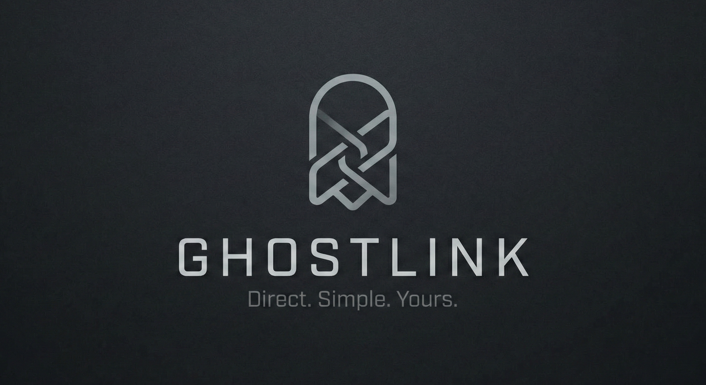
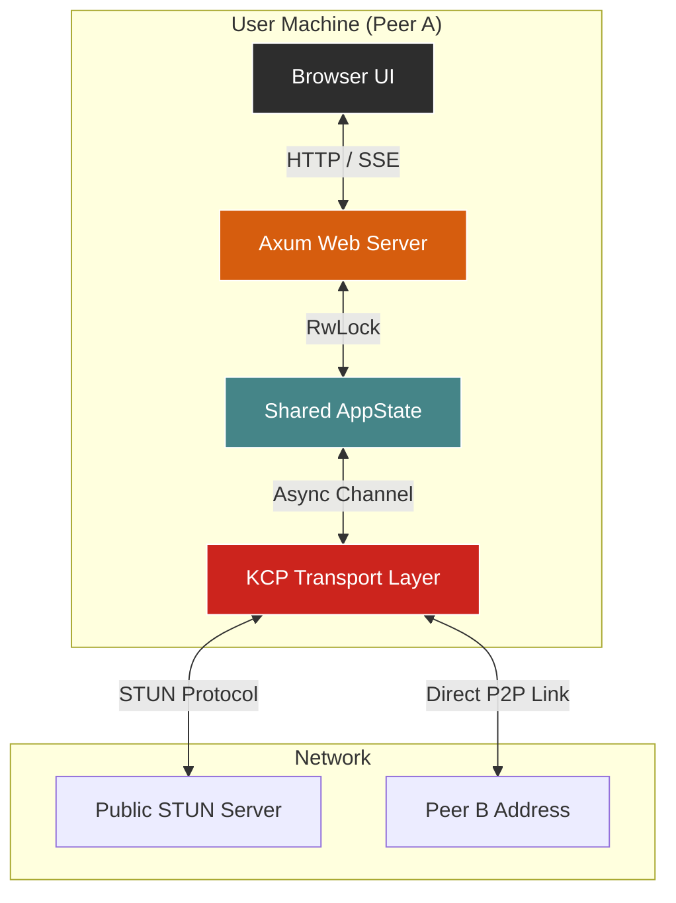

<div align="center">
  
  
  <a href="https://github.com/pushkar-gr/ghostlink/actions">
    
  </a>
  <a href="https://github.com/pushkar-gr/ghostlink/releases">
    
  </a>
  <a href="https://github.com/pushkar-gr/ghostlink/blob/main/LICENSE">
    
  </a>
  <a href="https://www.rust-lang.org/">
    
  </a>
</div>

# 👻 GhostLink

**High-Performance Serverless P2P Messaging**

GhostLink is a decentralized chat application engineered for direct peer-to-peer communication. By leveraging UDP hole punching and a custom reliability layer, it eliminates the need for central relay servers, ensuring messages travel the shortest path possible between peers.

This project prioritizes low-latency networking, asynchronous runtime efficiency, and clean architecture.

---

## 🗺️ Roadmap & Status

| Version | Status       | Description                                                                                                   |
|---------|--------------|---------------------------------------------------------------------------------------------------------------|
| v1.0    | **Stable**   | Current release. Feature complete for text exchange and reliable UDP transport.                              |
| v1.1    | **In Progress** | Security Hardening (QUIC). Replacing the KCP stack with QUIC (via `quinn`) to implement TLS 1.3 End-to-End Encryption. |

---

## ⚙️ Architectural Overview

GhostLink operates by decoupling the Web Interface from the P2P Networking Core, bridging them via shared thread-safe state.



### Communication Flow

1. **Initialization**: The application starts the Axum web server and the Tokio UDP listener simultaneously.
2. **Discovery**: The UDP layer queries a STUN server to resolve the machine's Public IP and punch a NAT hole.
3. **Signaling**: The user manually exchanges Public IPs with a peer via the Web UI.
4. **Transport**: Messages are routed from the UI → Shared State → KCP Stream → Peer.

---

## 🚀 Key Technical Features

- **True Peer-to-Peer**: Direct client-to-client connections minimize latency and remove dependency on third-party infrastructure.
- **Reliable UDP (ARQ)**: Utilizes KCP (via `tokio_kcp`) to provide TCP-like reliability with the speed advantages of UDP.
- **Automated NAT Traversal**: Integrated STUN client allows for seamless connectivity across different network configurations without manual port forwarding.
- **Asynchronous Core**: Built entirely on the Tokio runtime for non-blocking I/O and high concurrency.
- **Real-Time Updates**: State changes are pushed to the browser immediately via Server-Sent Events (SSE).

---

## 🛠️ Technology Stack

| Component     | Technology    | Role                                                 |
|---------------|---------------|-----------------------------------------------------|
| Runtime       | Tokio         | Asynchronous I/O scheduler and task management.     |
| Transport     | Tokio KCP     | Reliable UDP protocol implementation.               |
| Web Framework | Axum          | HTTP/REST interface and SSE stream handling.        |
| State         | Arc/RwLock    | Thread-safe state synchronization between tasks.    |
| Discovery     | STUN          | Public IP resolution and NAT hole punching.         |

---

## 🔒 Security Notice

> **WARNING**: *Protocol Status: Cleartext*

GhostLink v1.0 transmits data in plain text. While the transport layer provides reliability, it does not currently implement end-to-end encryption.

Do not transmit sensitive data (PII, credentials, financial information) over this version. Encryption is slated for the v1.1 release cycle (via QUIC).

---

## 📦 Installation & Usage

### Prerequisites

Ensure you have the latest stable version of Rust and Cargo installed.

### Quick Start

**Step 1**: Clone the repository.
```bash
git clone https://github.com/pushkar-gr/ghostlink.git
cd ghostlink
```

**Step 2**: Build and run.
```bash
cargo run --release
```

The first build may take a moment to compile dependencies.

**Step 3**: Initiate Connection.
- Navigate to `http://localhost:8080` in your web browser.
- Copy your Public IP displayed on the dashboard.
- Share your IP with a friend and input their IP into the Target Address field.
- Click **Establish Link**.

---

## 🤝 Contributing

We welcome contributions! 🚀

1. Fork the repository.
2. Create a feature branch.
   ```bash
   git checkout -b feature/amazing-feature
   ```
3. Commit your changes.
   ```bash
   git commit -m "Add some amazing feature"
   ```
4. Push to the branch.
   ```bash
   git push origin feature/amazing-feature
   ```
5. Open a Pull Request.

---

## 📄 License

This project is open-source and available under the **GNU General Public License v3.0**. See the [LICENSE](./LICENSE) file for details.

---

*Happy Chatting!* 👻