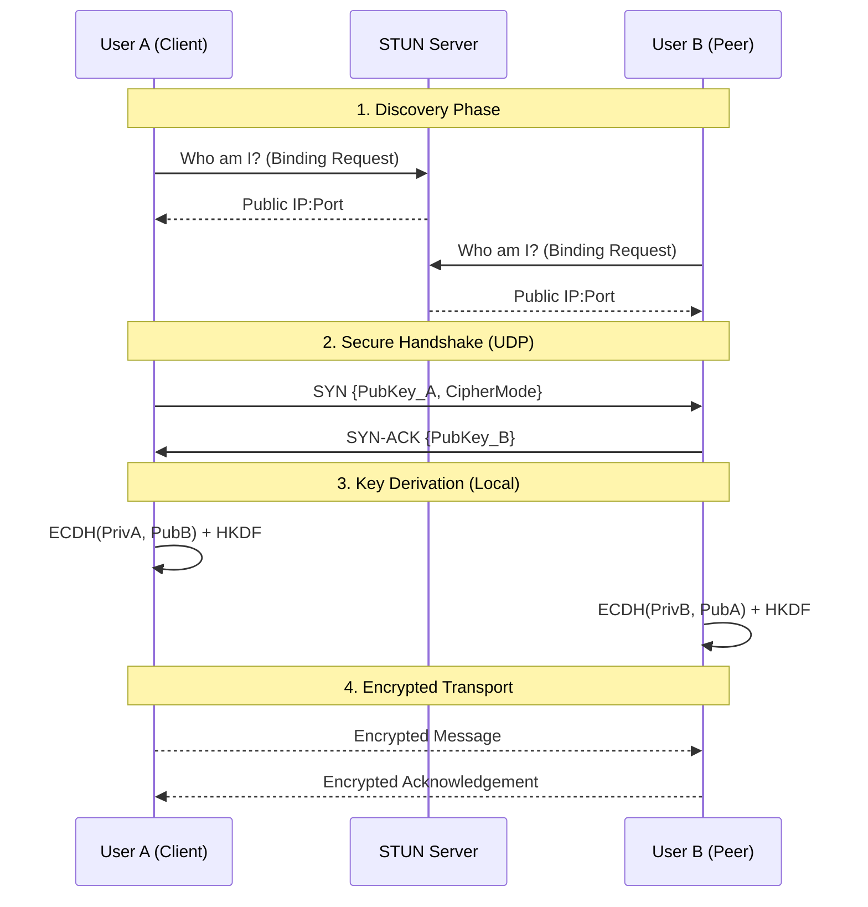

<div align="center">
  
  
  <a href="https://github.com/pushkar-gr/ghostlink/actions">
    
  </a>
  <a href="https://github.com/pushkar-gr/ghostlink/releases">
    
  </a>
  <a href="https://github.com/pushkar-gr/ghostlink/blob/main/LICENSE">
    
  </a>
  <a href="https://www.rust-lang.org/">
    
  </a>
</div>

# 👻 GhostLink

**High-Performance Serverless P2P Messaging**

GhostLink is a decentralized chat app. It connects users directly without using central servers. Direct communication reduces latency and improves performance.

---

## 🗺️ Roadmap & Status

| Version | Status       | Description                                                                                                   |
|---------|--------------|---------------------------------------------------------------------------------------------------------------|
| v1.0    | **Legacy**   | First release. Plaintext messaging with reliable UDP transport.                                              |
| v1.1    | **Stable**   | **Added Security**. End-to-End Encryption (E2EE) using X25519 and ChaCha20-Poly1305 encryption.               |

---

## ⚙️ Architecture

GhostLink separates the Web Interface from the P2P core. These parts communicate through thread-safe state. Version 1.1 also adds a secure handshake layer before starting a stream.

### Communication Flow



Steps:
1. **Initialization**: The app starts an HTTP web server and a UDP listener.
2. **Discovery**: The UDP layer uses a STUN server to get the public IP and open a connection.
3. **Secure Handshake**: Peers exchange public keys over UDP.
4. **Transport**: A reliable, encrypted stream is created for data transfer.

---

## 🚀 Features

- **End-to-End Encryption**: Uses X25519 keys and HKDF for secure communication.
- **Forward Secrecy**: Creates session keys for each connection.
- **Identity Verification**: Shows SAS codes so users can verify connections.
- **Reliable UDP**: Uses KCP for fast, reliable transport.
- **NAT Traversal**: Connects through networks using STUN.
- **Real-Time Updates**: Sends live updates to the web UI using SSE.

---

## 🛠️ Technology

| Component     | Technology             | Purpose                                           |
|---------------|------------------------|--------------------------------------------------|
| Runtime       | Tokio                  | Manages I/O and tasks.                          |
| Transport     | Tokio KCP              | Handles reliable UDP communication.             |
| Cryptography  | RustCrypto             | Provides secure key and encryption functions.   |
| Web Framework | Axum                   | HTTP REST API and real-time event streaming.    |
| State         | Arc/RwLock             | Ensures thread-safe state management.           |
| Discovery     | STUN                   | Resolves public IPs and opens connections.      |

---

## 🔒 Security

**STATUS: Encrypted**

GhostLink v1.1 uses encryption to secure data:
- **Key Exchange**: Uses X25519 elliptic-curve.
- **Ciphers**: Uses ChaCha20-Poly1305 or AES-256-GCM.
- **Verification**: Users can check fingerprints to avoid interception.

Private keys are only stored in memory and never sent or saved.

---

## 📦 Installation

### Requirements

Install the latest versions of Rust and Cargo.

### Quick Start

1. **Clone the repo**:
    ```bash
    git clone https://github.com/pushkar-gr/ghostlink.git
    cd ghostlink
    ```
2. **Build and run**:
    ```bash
    cargo run --release
    ```
3. **Create a connection**:
    - Open `http://localhost:8080` in your browser.
    - Copy your public IP.
    - Share it with a peer.
    - Set an optional alias.
    - Press **Establish Link**.
    - Verify the fingerprint matches your peer’s.

---

## 🤝 Contributing

1. Fork the repository.
2. Create a branch:
   ```bash
   git checkout -b feature/example-feature
   ```
3. Make and commit your changes:
   ```bash
   git commit -m "Explain the feature"
   ```
4. Push the branch:
   ```bash
   git push origin feature/example-feature
   ```
5. Open a Pull Request.

---

## 📄 License

This project is licensed under the **GNU General Public License v3.0**. See the [LICENSE](./LICENSE) file for details.

---

*Start chatting today!* 👻